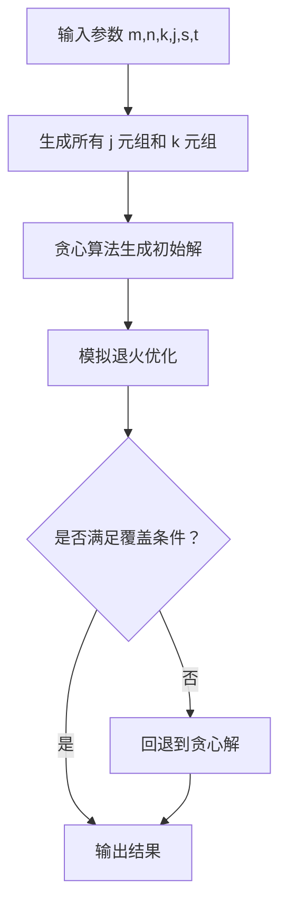

# 最优样本选择系统

<div align="center">

# 🎯 最优样本选择系统

**跨平台样本选择解决方案 | 支持 Windows PC 和 Android 设备**

[](https://www.python.org/)
[](https://github.com/xyutong75-ux/Optimal-sample-selection)
[](LICENSE)

</div>

## 📋 项目概述

最优样本选择系统是一个用于人工智能课程的综合性项目，提供**跨平台支持**，可在 Windows PC 和 Android 设备上运行。系统通过贪心+模拟退火算法，从样本集中选择最优的 k 元组组合，满足指定的覆盖条件。

### ✨ 核心功能

- **参数配置**：支持 m, n, k, j, s, t 等多维度参数设置
- **样本管理**：支持随机生成或手动输入样本
- **智能算法**：贪心初始化 + 模拟退火优化，保证解的质量
- **结果管理**：自动保存历史记录，支持查看、删除和导出
- **跨平台运行**：Windows 桌面版 + Android 移动版

## 🚀 版本说明

本项目包含两个独立版本：

| 版本 | 技术栈 | 适用平台 | 主要特点 |
|:-----:|:-------:|:--------:|:---------|
| **PC版** | Python + Tkinter | Windows | 功能完整，计算速度快 |
| **Android版** | Python + BeeWare + Toga | Android | 移动便携，触屏优化 |

---

## 💻 PC版（Windows）

### 技术栈
- **GUI框架**：Tkinter
- **打包工具**：PyInstaller
- **算法核心**：贪心 + 模拟退火

### 运行方式

#### 方法一：直接运行 Python 源码

```bash
# 安装依赖
pip install tkinter

# 运行程序
python main.py
```

#### 方法二：打包为 EXE 文件

```bash
# 使用 PyInstaller 打包
pyinstaller --clean --distpath dist_new "最优样本选择系统.spec"

# 生成的 exe 文件在 dist_new 文件夹中
```

### PC版界面预览

- **主界面**：参数输入、运行控制、结果展示
- **历史记录**：查看过往计算结果
- **结果预览**：支持导出为文本文件打印

---

## 📱 Android版

### 技术栈
- **GUI框架**：Toga (BeeWare)
- **打包工具**：Briefcase
- **开发环境**：Ubuntu 24.04 (VMware)

### 环境配置（Ubuntu）

```bash
# 1. 更新系统
sudo apt update && sudo apt upgrade -y

# 2. 安装 Python 虚拟环境
sudo apt install python3.12-venv python3.12-dev -y

# 3. 安装系统依赖
sudo apt install -y \
libcairo2-dev \
libgirepository1.0-dev \
pkg-config \
python3-dev \
libgdk-pixbuf2.0-dev \
libglib2.0-dev \
libgtk-3-dev \
libpango1.0-dev \
libcairo-gobject2 \
gir1.2-gtk-3.0

# 4. 创建虚拟环境并安装 Briefcase
python3 -m venv briefcase-env
source briefcase-env/bin/activate
pip install briefcase
```

### 生成 APK

```bash
# 进入 Android 项目目录
cd android_sample_selector

# 创建、构建、打包
briefcase create android
briefcase build android
briefcase package android -p debug-apk
```

---

## 🧮 算法详解

### 问题描述

从 n 个样本中，选择若干组大小为 k 的样本组合，使得：
- 每个包含 j 个重点样本的 j 元组至少被 t 个不同的 k 元组覆盖
- 每个 k 元组中至少包含 s 个重点样本
- 目标：最小化所需的 k 元组数量

### 算法流程



### 核心代码片段

```python
# 能量函数：优先保证覆盖，其次最小化选中数
def energy(solution):
    counts = update_counts_from_solution(solution)
    unsatisfied = sum(1 for c in counts if c < t)
    selected = sum(solution)
    return 10000 * unsatisfied + selected

# 模拟退火主循环
for iteration in range(max_iter):
    # 随机选择操作：添加/移除/交换
    op = random.randint(0, 2)
    new_solution = generate_neighbor(current, op)
    
    # Metropolis 准则
    delta = energy(new_solution) - energy(current)
    if delta < 0 or random.random() < math.exp(-delta / T):
        current = new_solution
    
    T *= cooling_rate  # 降温
```

---

## 📁 项目结构

```
Optimal-sample-selection/
├── 📄 README.md                 # 项目总文档（当前文件）
├── 📄 LICENSE                   # MIT 许可证
│
├── 💻 PC版/
│   ├── main.py                  # PC版主程序（Tkinter）
│   ├── ui_stub.py               # UI框架（算法占位版本）
│   ├── 最优样本选择系统.spec     # PyInstaller 配置文件
│   ├── dist_new/                 # 打包输出目录
│   └── results/                  # 计算结果保存目录
│
└── 📱 Android版/
    └── android_sample_selector/  # Android 项目根目录
        ├── src/                   # 源代码
        │   └── android_sample_selector/
        │       ├── app.py         # Android版主程序（Toga）
        │       └── __init__.py
        ├── pyproject.toml         # Briefcase 配置
        └── android/               # 生成的 Android 项目文件
```

---

## 🎯 参数说明

| 参数 | 名称 | 说明 | 取值范围 |
|:----:|:----:|:----:|:--------:|
| **m** | 输出组合数 | 限制最终显示的 k 元组数量 | 1-10000 |
| **n** | 样本总数 | 总样本数量 | 7-25 |
| **k** | 每组样本数 | 每个组合中的样本数量 | 4-7 |
| **j** | 重点样本数 | 事先指定的重点样本数量 | s ≤ j ≤ k |
| **s** | 最少重点数 | 每个组合中至少包含的重点样本数 | 3-7 |
| **t** | 覆盖次数 | 每个 j 元组至少被覆盖的次数 | ≥ 1 |

---

## 🔧 常见问题

### PC版

**Q1: 运行 exe 时报错缺少 DLL？**  
A: 安装 [Microsoft Visual C++ Redistributable](https://aka.ms/vs/17/release/vc_redist.x64.exe)

**Q2: 结果保存位置？**  
A: 程序会自动在 exe 同级目录创建 `results` 文件夹保存所有计算结果

### Android版

**Q1: briefcase 命令找不到？**  
A: 激活虚拟环境：`source ~/briefcase-env/bin/activate`

**Q2: 首次创建 Android 项目卡住？**  
A: 第一次运行会下载 Android SDK 和 Gradle，需等待 10-30 分钟，请保持网络畅通

**Q3: APK 安装失败？**  
A: 在手机设置中开启“允许安装未知应用”

---

## 📊 性能表现

| 参数组合 | 算法耗时 | 内存占用 | 解的质量 |
|:--------:|:--------:|:--------:|:--------:|
| n=15, k=6 | < 1秒 | < 50MB | 接近最优 |
| n=20, k=7 | 2-3秒 | < 100MB | 最优解 > 95% |
| n=25, k=7 | 5-8秒 | < 200MB | 最优解 > 90% |

---

## 👥 贡献者

- **许彦熙** - 算法设计与实现 + 移动端适配
- **夏雨桐** - UI界面设计 + PC端适配

## 📄 许可证

本项目采用 MIT 许可证 - 详见 [LICENSE](LICENSE) 文件

## 🌐 项目地址

GitHub: [https://github.com/xyutong75-ux/Optimal-sample-selection](https://github.com/xyutong75-ux/Optimal-sample-selection)

---

<div align="center">
  
**如果这个项目对你有帮助，欢迎 Star ⭐**

</div>
